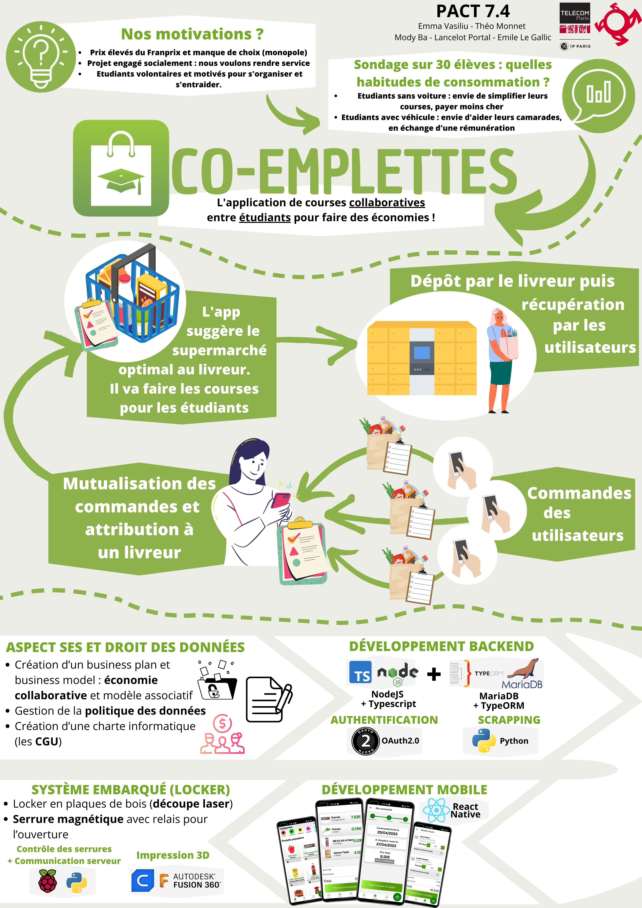
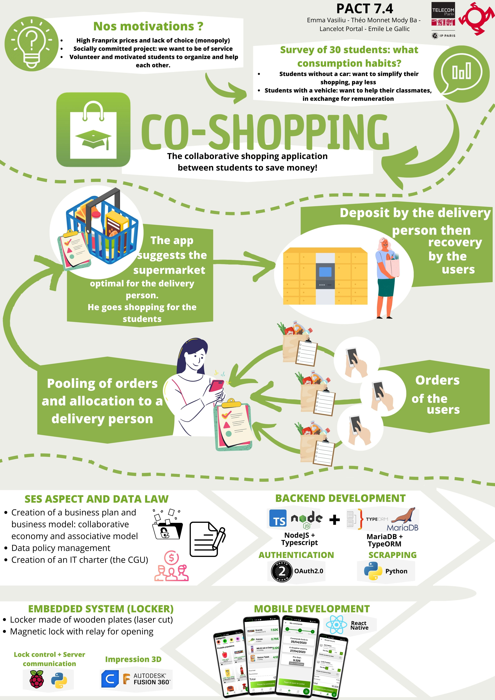
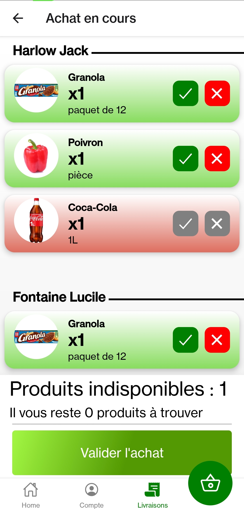
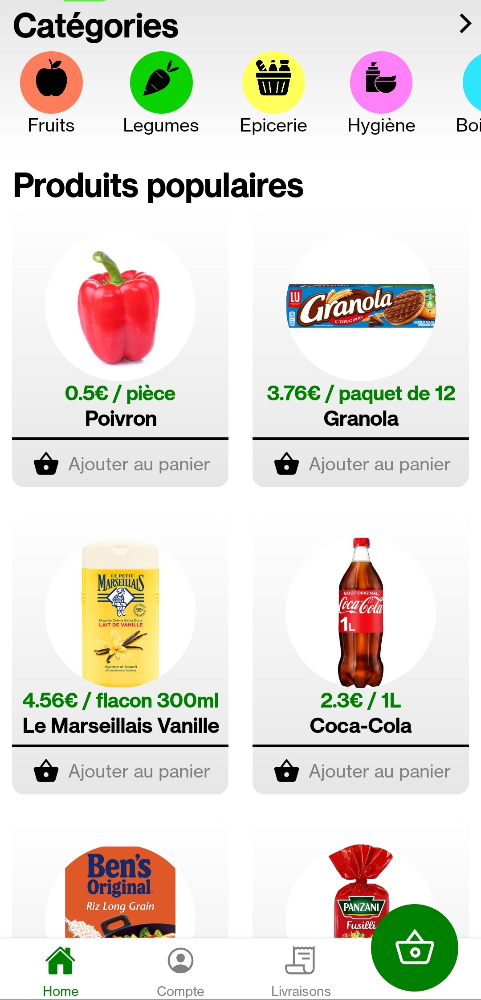
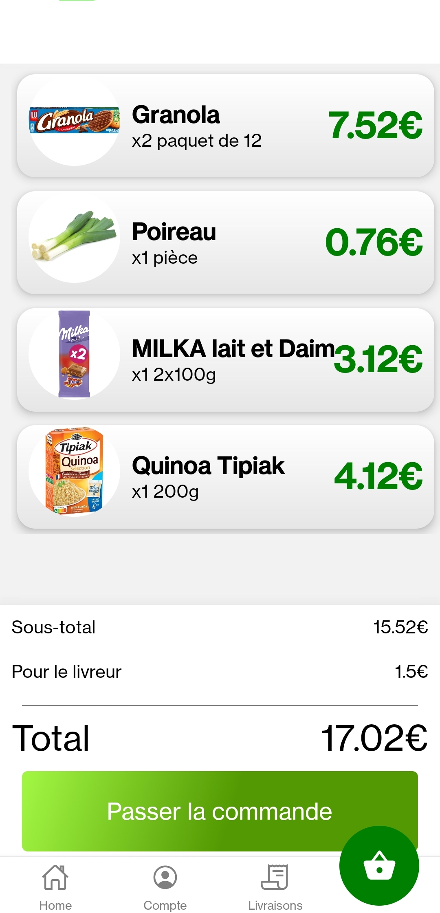
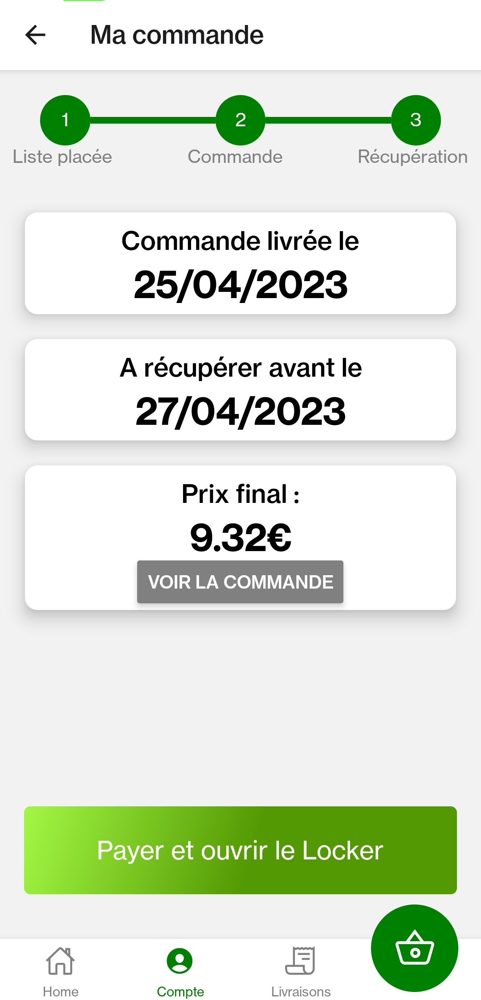
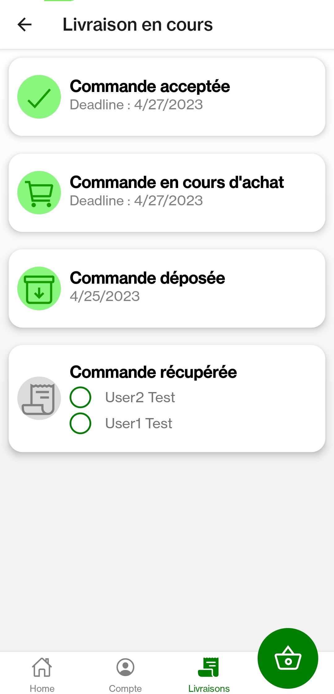

# Co-Emplettes: Shared Grocery Shopping for Students

## Overview

Co-Emplettes is a unique mobile application designed to address the challenges faced by students around the Télécom Paris campus in accessing affordable groceries. The platform facilitates shared grocery shopping, allowing students to collaborate on bulk purchases from more economical supermarkets.

## Problem Statement

The Saclay plateau lacks affordable shops, leading students to travel to more budget-friendly supermarkets. Co-Emplettes aims to streamline this process by enabling students to delegate grocery shopping to their peers who have convenient access to these stores. The goal is to reduce the overall cost of living for students while fostering a sense of community.

## Features

- **Shared Shopping Trips:** Students can coordinate and collaborate on grocery shopping trips, either by car or bike.
- **Delivery System:** Students who shop for groceries are paid by others, sharing the cost and effort of obtaining affordable goods.
- **Payment System:** Users contribute a small fee for the delivery service, which compensates the student shopper.
- **Drive Selection Algorithm:** The app evaluates various criteria (travel time, price, availability) to recommend the most suitable supermarket for each shared trip.
- **Locker System:** Groceries are organized in lockers by the student shopper, allowing convenient pick-up by recipients based on their schedules.
- **Fresh Produce Option:** Specialized option for fresh produce allows users to customize their orders, with delivery persons picking up products in-store.

## App images showcase

# Mockup Image Showcase

| Poster (FR) | Poster |
|-------------|--------|
|  |  |

| Cart Summary | Menu landing page | Cart Summary |
|----------------|----------------|----------------|
|  |  |  |

| Command Tracking 1 | Command Tracking 2 |
|----------------|----------------|
|  |  |

## Technologies Used

- **React Native:** Mobile application development for iOS and Android platforms.
- **TypeScript:** A statically typed superset of JavaScript for enhanced code quality.
- **Node.js:** Server-side JavaScript runtime for building scalable network applications.
- **Express:** Web application framework for Node.js, simplifying the development of robust APIs.

## Installation and Usage

See [`/app/README.md`](./app/README.md) for the mobile application.

See [`/backend/README.md`](./backend/README.md) for the backend side.

For detailed instructions, refer to the respective README files in the `app` and `backend` directories.

## Future Enhancements

- **Expanded Ad Integration:** Explore partnerships with local businesses for targeted advertisements.
- **Optimized Routing:** Implement advanced algorithms for optimizing routes based on various factors.
- **User Feedback System:** Gather user feedback to continuously improve the application.
- **Integration with Campus Events:** Collaborate with campus event organizers for enhanced advertising opportunities.
- **Enhanced Security Measures:** Implement secure authentication and payment systems for user protection.

## Contribution Guidelines

We welcome contributions from the community. Please refer to the `CONTRIBUTING.md` file for guidelines on how to contribute to the project.

## License

This project is licensed under the [MIT License](LICENSE.md).
