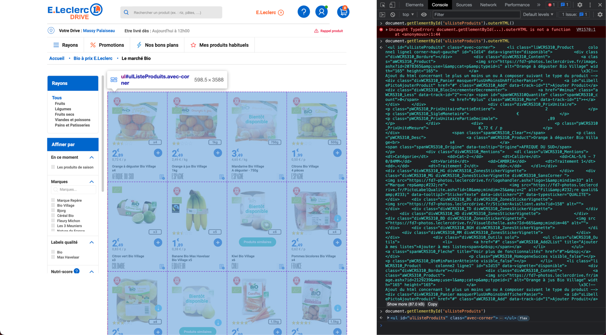

# Récupérer les données des sites marchands

## Prérequis

- Python 3.6
- pip
- BeautifulSoup

## Utilisation

Depuis le site marchand, récupérer les données de la page produit et les mettre dans un fichier .html.
 L'élément requis s'obtient facilement depuis la console Javascript du navigateur:
<code>document.getElementById('ElementID').outerHTML</code>
 Mettez tout les fichiers .html dans le dossier <b>data</b> du projet.

### Spécificités par site

Leclerc : récupérer seulement l'élément d'ID <b>ulListeProduits</b> des pages rayons.
 

 
Auchan :
 
Carrefour :
 
Cora : 
 
Intermarché :
 
Casino :

## Exécution

L'exécution du script produit 2 fichiers json exportables sur la base de données.
 Un fichier <b>products.json</b> contenant les produit.
 Un fichier <b>supermarketProducts.json</b> contenant les données spécifiques au supermarché.