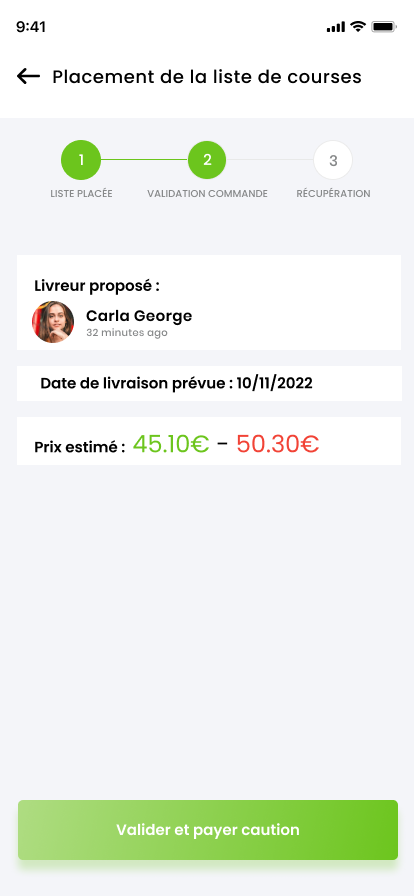
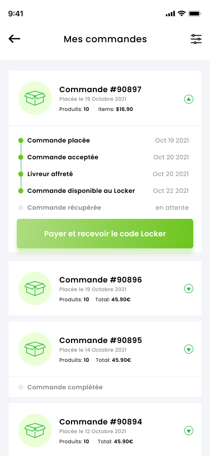

=== Interface utilisateur graphique

Il peut y avoir une ou plusieurs interfaces utilisateur (UI en anglais),
ou interface graphique, ou interface homme machine (IHM) : une interface
sur ordinateur et/ou une interface sur mobile ou tablette (Android),
selon le nombre d’appareils en jeu.

En lien avec un diagramme de séquence, une description simple de chaque
écran/page est nécessaire. Il est recommandé de faire des dessins, même
dessins au crayon, photographiés ou scannés, car ce sont les meilleurs
supports de discussion : on appelle souvent ces dessins un « storyboard ». Une description textuelle fait le lien entre tous les
éléments de l’IHM (ou des IHMs).

== Compte: connexion et enregistrement 
[cols="1,1"]
|===
| 
Landing Page de l'application
|
Page d'enregistrement

|
Page de connexion
|
Page "mon compte"
|===

<<< 
<<< 
<<< 

== Création d'une liste de course : choix des produits
[cols="1,1"]
|===
|
Menu choix des produits disponibles
|
Liste des produits dans une catégorie

|
Catégories de produits
|image:../images/mockup/detail_produit.png[]
Détail d'un produit

|
Récapitulatif de la création d'une liste de course
|
Page favorits pour faciliter la conception d'une liste de course
|===

<<< 
<<< 
<<< 

== Suivi de la commande passée pour une liste de course
[cols="1,1"]
|===
|
Liste de course déposée par un utilisateur : en attente d'une assignation à un livreur 
|
Liste de course acceptée et prise en charge par un livreur

|
Suivi de la commande côté utilisateur
|
Suivi de la commande côté utilisateur
|===

<<< 
<<< 
<<< 

== Interface livreur : gestion des commandes proposées et en cours
[cols="1,1"]
|===
|
Proposition de commande côté livreur : consultation des détails de la commande avant de l'accepter
|
Proposition de commande côté livreur : commande acceptée, passage à l'achat

|
Détail de la commande pour faciliter la création des différents paniers lors de l'achat de la commande pour le livreur
|
Détail de la commande pour faciliter la création des différents paniers lors de l'achat de la commande pour le livreur

|
Scan des tickets de caisses en fin de commande pour calculer le montant total de l'achat
|
Scan des tickets de caisses en fin de commande pour calculer le montant total de l'achat

|
Dépôt de la commande au locker par le livreur
| 
|===