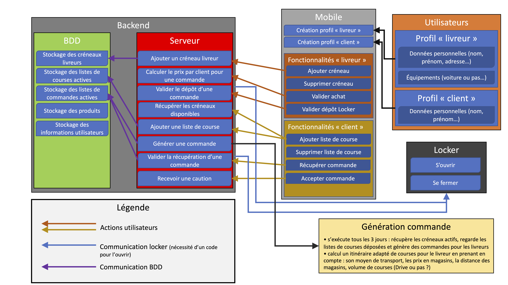

=== Schéma d’architecture

// Insérer ici un ou plusieurs schémas d’architecture du projet. Voir le
// cours d’introduction au Génie Logiciel. N’hésitez pas à faire des
// schémas hiérarchiques, c'est-à-dire avec un bloc d’un schéma général
// raffiné dans un second schéma ; ou des schémas en plusieurs parties.

==== Répartition en modules

[cols=",,",options="header",]
|====
| Module | Elèves | Validé par
| React Native/App | Lancelot et Emile | J.C. Dufourd
| BBD, API, Serveur, Produit | Emile, Théo et Mody | A. Amarilli
| Analyse de Graphes | Mody et Emma | Tiphaine Viard
| Systèmes embarqués | Théo | T. Graba
| SES| Emma et Lancelot | A. Ouahab
| Tests et Intégrations| Emma et Théo | Elise Bonnail
|====

==== Schéma architectural en blocs

 

// *Exemple utilisant http://www.graphviz.org/Documentation.php[graphviz]*
// Voir la liste des outils supportés par http://asciidoctor.org/docs/asciidoctor-diagram/[asciidoctor-diagram].
// **(Vous pouvez, bien sûr, utiliser votre outil de dessin préféré).**

// ==== Description des blocs

// Il faut ici une description textuelle de chaque bloc, sa fonction
// détaillée. En général, un bloc correspond à un module, sauf exception.
// Il peut être adapté de faire des blocs plus petits qu’un module.

// Il est important ici de distinguer les bibliothèques identifiées et
// disponibles de ce que vous allez produire (coder) vous-même. Vous ne
// devez pas réinventer la roue, mais vous ne devez pas non plus avoir votre
// projet tout fait en encapsulant un programme déjà existant.

// ===== NomBloc1

// Description textuelle du bloc 1.

// ===== NomBloc2

// Description textuelle du bloc 1.

// *Exemple utilisant http://blockdiag.com/en/actdiag/index.html[actdiag]*
// **(Vous pouvez, bien sûr, utiliser votre outil de dessin préféré).**

// Voir la liste des outils supportés par http://asciidoctor.org/docs/asciidoctor-diagram/[asciidoctor-diagram].
