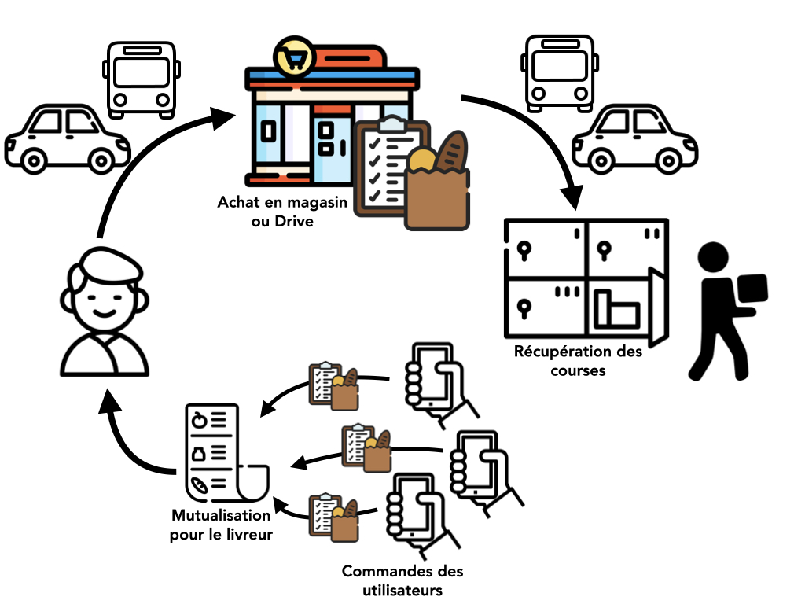

=== Description de la proposition

==== Proposition en français

Co-Emplettes est une application pour les courses entre les étudiants du plateau.

Le problème initial auquel nous avons voulu répondre est le manque de commerce aux prix abordable sur le plateau de Saclay et donc le coût élevé de la vie étudiante. En effet, de nombreux étudiants vont faire leurs courses ailleurs, dans des supermarchés plus abordables, le plus souvent en voiture, et emmènent souvent des camarades pour chacun puisse aller faire des courses moins chères.
L'idée est alors de déléguer l'achat de courses aux étudiants pouvant se déplacer dans ces supermarchés plus abordables et des les ramener sur le campus pour les distribuer aux autres étudiants.

Les étudiants qui s’occupent de la livraison sont rémunérés pour le transport. Il peut s’agir de personnes en voiture ou bien de cyclistes. Les étudiants paieraient alors un petit surplus pour la livraison qui servira à la rémunération du livreur. Cette rémunération pourrait également être complétée à l’aide de publicités sur l’application, idéalement pour des évènements étudiants ou certaines enseignes de distribution, voire pourquoi pas des entreprises ou producteurs locaux.

L’application rassemble tous les drives dans un certain rayon autour du plateau et s’occupe de calculer quel commerce est à privilégier selon plusieurs critères (temps de trajet pour le conducteur, prix, disponibilités…).

Un système de Locker, dans lequel les courses seront disposées par le livreur, sera mis en place afin que chaque personne puisse venir récupérer ses courses dans un endroit froid selon son emploi du temps.

L’application pourrait aussi intégrer la livraison pour les groupes en résidence universitaire, dans le cas où aucun étudiant livreur ne soit disponible. L’application privilégiera toujours la livraison par un étudiant.

Bien que le drive soit l’option par défaut, on pourrait imaginer une option spéciale pour les produits frais pour que le livreur aille chercher les produits dans le magasin. Cela permettrait de choisir des produits plus ou moins mûrs. Pour faire gagner du temps, on peut envisager de cartographier les commerces dans ces zones spécifiques. La vérification se fera via une photo du ticket de caisse.

==== Proposal in english

Co-Emplettes is an app allowing students around the Télécom Paris campus to shop for groceries together.

The initial problem to which we wanted to respond is the lack of shops at affordable prices on the Saclay plateau and therefore the high cost of student life. Indeed, many students go shopping elsewhere, in more affordable supermarkets, most often by car, and often take friends with them so that everyone can go shopping for less.
The idea is then to delegate the purchase of groceries to students who can go to these more affordable supermarkets and bring them back to campus to distribute to other students.

The student who delivers the groceries to the others is paid. They can go to the supermarket by car or by bike. The other students would then pay a small fee for the delivery which would be used to pay the student buying the groceries. This remuneration could also be supplemented by advertisements on the application, ideally for student events or certain retailers, or even local businesses or producers.

The application gathers all the Drives in a certain radius around the plateau and calculates which business is to be preferred according to several criteria (travel time for the driver, price, availability...). 

A Locker system, in which the groceries will be arranged by the driver, will be set up so that each person can come and pick up his groceries in a cold place according to his schedule. 

The application could also integrate delivery for groups in university residences, in case no student delivery person is available. The app will always favor delivery by a student. 

While drive-through is the default option, one could imagine a special option for fresh produce to have the delivery person pick up the produce in the store. This would allow for a choice of more or less ripe products. To save time, we could consider mapping the shops in these specific areas. Verification would be done via a photo of the receipt.

<<<

==== Fonctionnement de l'application (visuel)

 

<<<

// *_Note: 2 page max._*

// _Décrire de façon détaillée votre projet : motivations de base/problèmes
// constatés avant élaboration du projet, comment votre projet répond à ces
// besoins. Ajouter une image ou une figure pour montrer à quoi cela
// ressemble si besoin._

// Amet, tellus. Maecenas a dolor. Praesent tempor, felis eget gravida
// blandit, urna lacus faucibus velit, in consectetuer sapien erat nec
// quam. Integer bibendum odio sit amet neque. Integer imperdiet rhoncus
// mi. Pellentesque malesuada purus id purus. Quisque viverra porta lectus.
// Sed lacus leo, feugiat at, consectetuer eu, luctus quis, risus.
// Suspendisse faucibus orci et nunc. Nullam vehicula fermentum risus.
// Fusce felis nibh, dignissim vulputate, ultrices quis, lobortis et, arcu.
// Duis aliquam libero non diam.

// Vestibulum placerat tincidunt tortor. Ut vehicula ligula quis lectus. In
// eget velit. Quisque vel risus. Mauris pede. Nullam ornare sapien sit
// amet nisl. Cras tortor. Donec tortor lorem.

// === Exemples d'utilisation d'AsciiDoc

// _Ici quelques exemples de syntaxe AsciiDoc pour ajouter des équations, des images, des listes..._

// _Ces exemples *ne doivent pas* être conservés dans la version finale du rapport._

// ==== Exemples d'équations

// * Inline math: latexmath:[\int_{-\infty}^\infty g(x) dx]
// Pour ajouter une équation ou un symbole mathématique dans le corps du texte.

// * Block math pour avoir une équation centrée au milieu de la page:

// [latexmath]
// ++++
// \int_{-\infty}^\infty g(x) dx
// ++++

// ==== Exemples d'images

// * Ceci est un exemple d'image:

// image::../images/logo_PACT.png[logo pact]

// * L'image peut être redimensionnée et avoir un titre:

// .Le logo du projet
// image::../images/logo_PACT.png[logo pact, 400, 400]

// * Pour le rapport, les images peuvent être aux formats jpeg, png ou même *svg*:

// image::../images/pact.svg[un autre logo pact,300,300]

// * Les images peuvent aussi être mises dans le corps du texte par exemple image:../images/logo_PACT.png[logo pact, 50,50].

// ==== Exemples de code

// On peut ajouter des blocs de code formatés en précisant le langage utilisé:

// [source,python]
// ----
// def func(i):
//    x = 3 + i
//    return x

// for i in range(10):
//    print "---> ", func(i)
// ----

// [source,java]
// ----
// class foo {
//    Integer i;
//    String s;
// }
// ----

// ==== Exemples de listes

// * AAAA
// ** aaaaa
// *** axaxax
// ** bbbbb
// ** ccccc
// * BBBB
// * CCCC

// '''''

// .  AAAA
// ..  aaaa
// ..  bbbb
// .  BBBB
// .  CCCC

// '''''

// .Liste des tâches à faire:
// *  [ ] Pas encore fait
// ** [ ] étape X
// ** [x] étape Y (a démarré en avance)
// ** [ ] étape Z
// *  [x] Complètement finit
// ** [x] étape Q
// ** [x] étape R
// ** [x] étape `finale` E=mc^2^

// '''''

// .Liste descriptive:

// Étape 1::: Faire A, B, C…
// Étape 2::: Faire X, Y, Z…
// Étape 3::: Faire W, et c'est fini…

